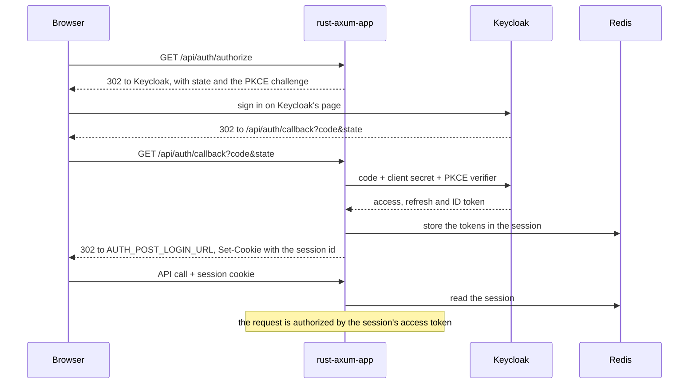

# Authentication

The application never handles a credential. Keycloak (realm `rust-axum-app`) owns every page that touches one: sign-up,
sign-in, email verification, password reset, two-factor authentication and acceptance of the terms of use. The
application is a BFF: it runs the sign-in, keeps the tokens on the server and gives the browser only a session cookie.

## Signing in

1. The browser opens `GET /api/auth/authorize`. The application stores a fresh `state` and PKCE verifier in the session
   and redirects to Keycloak with the challenge. Optional parameters pass through: `register=true` opens the sign-up
   page, and `kc_action` starts one of `CONFIGURE_TOTP`, `UPDATE_PASSWORD` or `delete_credential`. The
   `Accept-Language` header picks Keycloak's language when it is `pl` or `en`.
2. Keycloak returns to `GET /api/auth/callback`. The application checks that the `state` is the one it issued to this
   browser, exchanges the code with the confidential client `rust-axum-app` and its secret, verifies the access token
   and mirrors the account into PostgreSQL.
3. It then issues a new session identifier, stores the tokens in the session and redirects to `AUTH_POST_LOGIN_URL`.
   When the account cannot be written it ends the Keycloak session again; any failure redirects with
   `?error=sign_in_failed`, and a `state` this browser was not given with `?error=state_mismatch`.

The browser holds only the `RUST_AXUM_APP_SESSION` cookie: `HttpOnly`, `SameSite=Lax`, and `Secure` when
`SESSION_COOKIE_SECURE=true`.

## Every request is authorized by a token

`authenticate`, the middleware `bootstrap` layers onto the protected routers, takes the access token from
`Authorization: Bearer` or, for a browser, from its session. `JwksTokenVerifier` checks the signature against
Keycloak's published keys (cached by key id), the issuer, the expiry and the audience (`KEYCLOAK_AUDIENCE`), and the
roles come from `realm_access.roles`. The resulting `Caller` is what `Auth` and `RequireAdmin` read.

Either way the decision rests on the token alone, so any instance can serve any request.

## Sessions and refreshing

The session lives in Redis, and its access token is refreshed once per refresh token, across instances: [Token
refresh](../src/identity/docs/mechanisms/token-refresh.md).

## Signing out

`POST /api/auth/logout` revokes the refresh token at Keycloak, which ends the Keycloak session, and clears the local
one.

## Cross-site requests

An unsafe request from another site gets no token: [Cross-site
requests](../src/identity/docs/mechanisms/cross-site-requests.md).

## Code

| Path                                                 | Role                                                  |
|------------------------------------------------------|-------------------------------------------------------|
| `identity/infrastructure/http/routes/auth.rs`        | authorize, callback, session, logout                  |
| `identity/infrastructure/http/extract.rs`            | the `authenticate` middleware, `Auth`, `RequireAdmin` |
| `identity/infrastructure/keycloak/client.rs`         | code exchange, refresh, revocation                    |
| `identity/infrastructure/keycloak/shared_refresh.rs` | one refresh per refresh token across instances        |
| `identity/infrastructure/keycloak/verifier.rs`       | token verification against Keycloak's keys            |
| `identity/infrastructure/session_store.rs`           | the Redis session store                               |
| `identity/application/service.rs`                    | sign-in, refresh, sign-out and the account mirror     |
